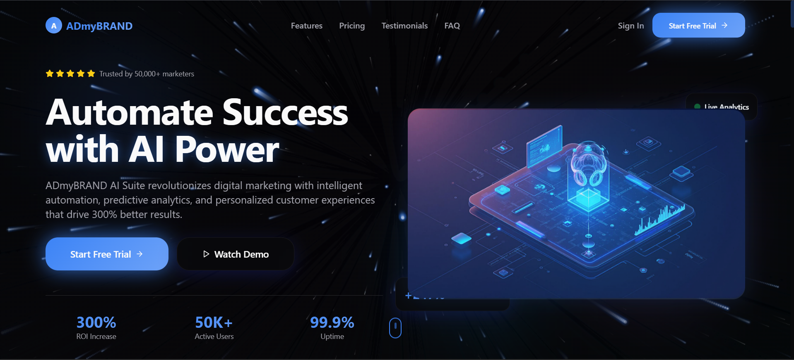
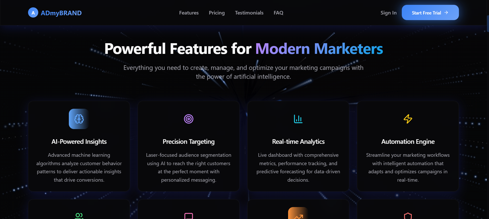
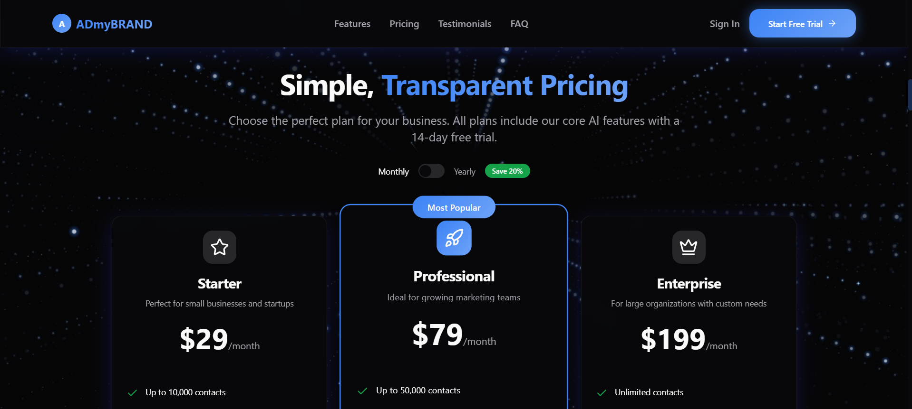
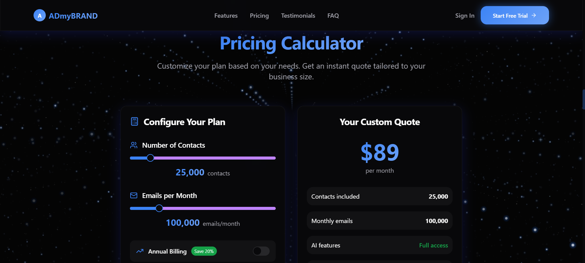
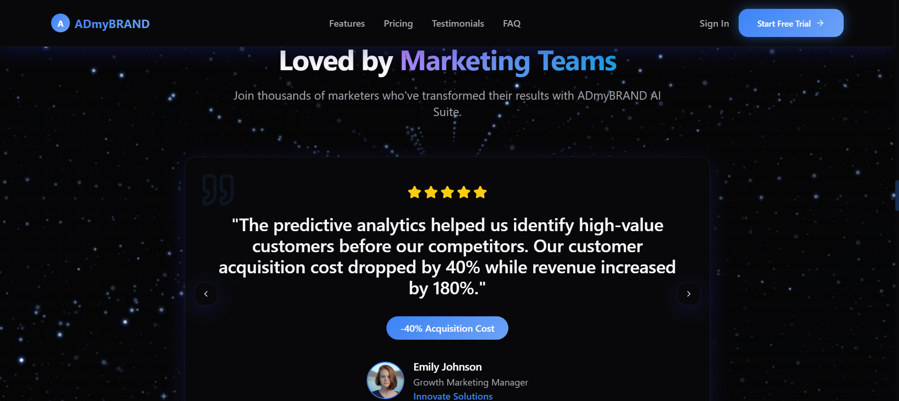
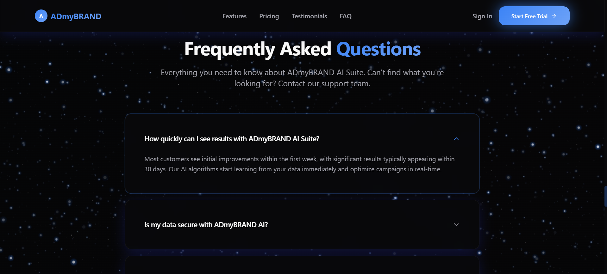
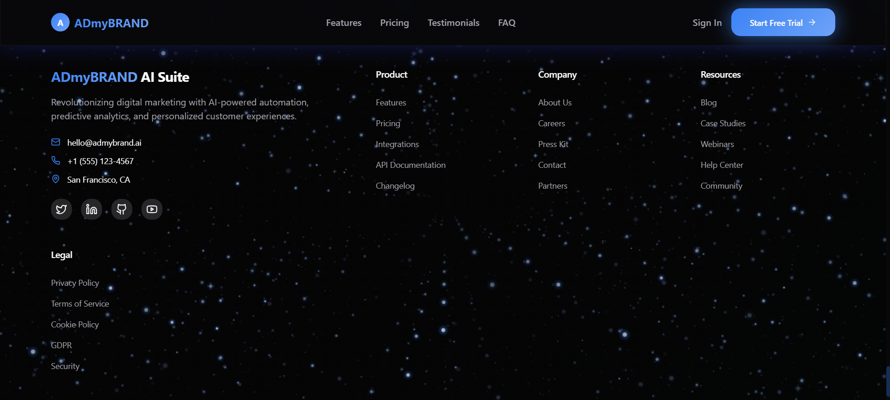

# ADmyBRAND AI Suite - AI-Powered Marketing Platform

[](https://reactjs.org/)
[](https://www.typescriptlang.org/)
[](https://vitejs.dev/)
[](https://tailwindcss.com/)
[](LICENSE)

A modern, responsive web application showcasing ADmyBRAND AI Suite - an AI-powered marketing platform that revolutionizes digital marketing with intelligent automation, predictive analytics, and personalized customer experiences. Built with React, TypeScript, and Tailwind CSS featuring interactive 3D elements and a beautiful glassmorphism UI.

## 🎯 Quick Preview

- **Live Demo**: [https://admybrannd.netlify.app/](https://admybrannd.netlify.app/) - See it in action!
- **Interactive 3D Elements**: Floating orbs and animated backgrounds
- **Glassmorphism UI**: Modern glass-like design components
- **AI Marketing Suite**: Comprehensive automation platform
- **Responsive Design**: Works perfectly on all devices
- **300% ROI Increase**: Proven results for marketers

## 📸 Screenshots

### 🏠 Hero Section

*Main landing page featuring "Automate Success with AI Power" with interactive 3D elements and glowing orbs*

### ⚡ Features Section

*Showcase of powerful AI marketing features including AI-Powered Insights, Precision Targeting, and Real-time Analytics*

### 💰 Pricing Plans

*Transparent pricing with Starter, Professional, and Enterprise plans with 20% yearly savings*

### 🧮 Interactive Pricing Calculator

*Custom pricing calculator allowing users to configure contacts, emails, and billing options*

### 💬 Customer Testimonials

*Real customer success stories with 5-star ratings and proven ROI improvements*

### 📞 Contact Form

*Get in touch form with modern glassmorphism design and starry background*

### ❓ FAQ Section

*Frequently asked questions with expandable accordion interface*

### 🦶 Footer

*Comprehensive footer with company information, product links, and social media*

> **💡 Tip**: Replace the image paths above with your actual screenshot URLs. You can upload images to GitHub Issues, Imgur, or store them in an `assets/screenshots/` folder in this repository.

## 🚀 Features

### Core Marketing Features
- **AI-Powered Insights**: Advanced machine learning algorithms analyze customer behavior patterns
- **Precision Targeting**: Laser-focused audience segmentation using AI
- **Real-time Analytics**: Live dashboard with comprehensive metrics and performance tracking
- **Automation Engine**: Streamline marketing workflows with intelligent automation
- **Customer Journey Mapping**: Visualize and optimize every touchpoint in customer journeys
- **Smart Content Generation**: AI-generated copy and personalized content at scale
- **Predictive Modeling**: Forecast market trends and campaign performance
- **Enterprise Security**: Bank-level security with end-to-end encryption

### Technical Features
- **Modern React Stack**: React 18, TypeScript, Vite
- **UI Components**: shadcn/ui with custom enhancements
- **Styling**: Tailwind CSS with custom animations and glassmorphism effects
- **3D Graphics**: Three.js integration for interactive floating orbs
- **Form Handling**: React Hook Form with Zod validation
- **State Management**: TanStack Query for server state
- **Routing**: React Router DOM
- **Animations**: Custom scroll reveals, typing effects, and smooth transitions

## 🛠️ Tech Stack

### Frontend
- **React 18.3.1** - Modern React with latest features
- **TypeScript 5.5.3** - Type-safe development
- **Vite 5.4.1** - Fast build tool and dev server

### UI & Styling
- **Tailwind CSS 3.4.11** - Utility-first CSS framework
- **shadcn/ui** - High-quality React components
- **Radix UI** - Accessible component primitives
- **Lucide React** - Beautiful icons

### 3D & Animations
- **Three.js** - 3D graphics for floating orbs
- **Custom CSS Animations** - Smooth transitions and effects
- **Scroll Reveal** - Animated content on scroll

### Forms & Validation
- **React Hook Form** - Performant forms
- **Zod** - TypeScript-first schema validation
- **@hookform/resolvers** - Form validation integration

### State & Data
- **TanStack Query** - Server state management
- **React Router DOM** - Client-side routing

### Additional Libraries
- **Recharts** - Data visualization
- **Sonner** - Toast notifications
- **date-fns** - Date utilities
- **class-variance-authority** - Component variants

## 📦 Installation & Setup

### Prerequisites
- Node.js (v18 or higher)
- npm or yarn package manager

### Quick Start

1. **Clone the repository**
   ```bash
   git clone <your-repo-url>
   cd ADmyBRAND-ai-suite
   ```

2. **Install dependencies**
   ```bash
   npm install
   # or
   yarn install
   ```

3. **Start the development server**
   ```bash
   npm run dev
   # or
   yarn dev
   ```

4. **Open your browser**
   Navigate to `http://localhost:5173` to view the application

### Available Scripts

- `npm run dev` - Start development server
- `npm run build` - Build for production
- `npm run build:dev` - Build for development
- `npm run preview` - Preview production build
- `npm run lint` - Run ESLint

## 🏗️ Project Structure

```
src/
├── components/
│   ├── 3D/                 # 3D interactive elements
│   │   ├── FloatingOrb.tsx # Interactive floating orbs
│   │   └── InteractiveCard3D.tsx
│   ├── sections/           # Page sections
│   │   ├── HeroSection.tsx # Main landing section
│   │   ├── FeaturesSection.tsx # Feature showcase
│   │   ├── PricingSection.tsx # Pricing plans
│   │   ├── TestimonialsSection.tsx # Customer testimonials
│   │   ├── FAQSection.tsx # Frequently asked questions
│   │   └── Footer.tsx # Site footer
│   ├── ui/                 # Reusable UI components
│   │   ├── glass-card.tsx # Glassmorphism cards
│   │   ├── gradient-text.tsx # Animated gradient text
│   │   ├── scroll-reveal.tsx # Scroll animations
│   │   ├── cycling-typing-effect.tsx # Dynamic typing
│   │   └── ... # Other shadcn/ui components
│   ├── Navigation.tsx # Site navigation
│   ├── ContactForm.tsx # Contact form component
│   └── PricingCalculator.tsx # Interactive pricing calculator
├── pages/                  # Main page components
│   ├── Index.tsx # Main entry point
│   ├── LandingPage.tsx # Landing page layout
│   └── NotFound.tsx # 404 page
├── hooks/                  # Custom React hooks
├── lib/                    # Utility functions
└── assets/                 # Static assets
    └── hero-dashboard.jpg # Hero section image
```

## 🎨 Key Components

### 3D Elements
- `FloatingOrb.tsx` - Interactive floating orbs with Three.js integration
- `InteractiveCard3D.tsx` - 3D card interactions and effects

### UI Components
- `GlassCard.tsx` - Glassmorphism card component with hover effects
- `GradientText.tsx` - Animated gradient text with multiple color schemes
- `ScrollReveal.tsx` - Scroll-triggered animations with direction control
- `CyclingTypingEffect.tsx` - Dynamic typing animation for hero text
- `StarryBackground.tsx` - Animated starry background effect

### Sections
- `HeroSection.tsx` - Main landing section with cycling text and stats
- `FeaturesSection.tsx` - Feature showcase with 8 core AI marketing features
- `PricingSection.tsx` - Pricing plans and subscription options
- `TestimonialsSection.tsx` - Customer testimonials and reviews
- `FAQSection.tsx` - Frequently asked questions with accordion

### Interactive Components
- `PricingCalculator.tsx` - Interactive pricing calculator
- `ContactForm.tsx` - Contact form with validation
- `Navigation.tsx` - Responsive navigation with smooth scrolling

## 🚀 Deployment

### Vercel (Recommended)
1. **Connect Repository**: Go to [vercel.com](https://vercel.com) and connect your GitHub repository
2. **Auto-Detection**: Vercel will automatically detect the Vite configuration
3. **Deploy**: Click deploy with default settings
4. **Custom Domain**: Add your custom domain in the Vercel dashboard

### Netlify
1. **Build Command**: `npm run build`
2. **Publish Directory**: `dist`
3. **Environment Variables**: Add any required environment variables in Netlify dashboard

### GitHub Pages
1. **Build**: `npm run build`
2. **Deploy**: Use GitHub Actions or manually upload `dist` folder to `gh-pages` branch

### Other Platforms
The application can be deployed to any static hosting platform that supports React applications.

## 🔧 Configuration

### Environment Variables
Create a `.env` file in the root directory for any environment-specific configurations:

```env
VITE_API_URL=your_api_url_here
VITE_ANALYTICS_ID=your_analytics_id
```

### Tailwind Configuration
Custom Tailwind classes and animations are configured in `tailwind.config.ts`.

### Vite Configuration
Build and development settings are configured in `vite.config.ts`.

## 🤝 Contributing

1. Fork the repository
2. Create a feature branch: `git checkout -b feature-name`
3. Make your changes
4. Run tests: `npm run lint`
5. Commit your changes: `git commit -m 'Add feature'`
6. Push to the branch: `git push origin feature-name`
7. Submit a pull request

## 📝 License

This project is licensed under the MIT License - see the [LICENSE](LICENSE) file for details.

Copyright (c) 2024 ADmyBRAND

## 🆘 Support

For support and questions:
- Create an issue in the GitHub repository
- Check the documentation in the `/docs` folder
- Review the component examples in `/src/components`

## 🔮 Roadmap

- [ ] Add more 3D interactive elements
- [ ] Implement dark/light theme toggle
- [ ] Add more animation presets
- [ ] Create component documentation
- [ ] Add unit tests
- [ ] Implement PWA features
- [ ] Add internationalization support
- [ ] Integrate with actual AI marketing APIs
- [ ] Add user authentication and dashboard
- [ ] Implement real-time analytics dashboard

## 📊 Performance Metrics

The platform promises:
- **300% ROI Increase** for marketing campaigns
- **50,000+ Active Users** worldwide
- **99.9% Uptime** reliability
- **Real-time Analytics** and insights
- **AI-Powered Automation** for marketing workflows

---

Built with ❤️ using modern web technologies for the future of AI-powered marketing
